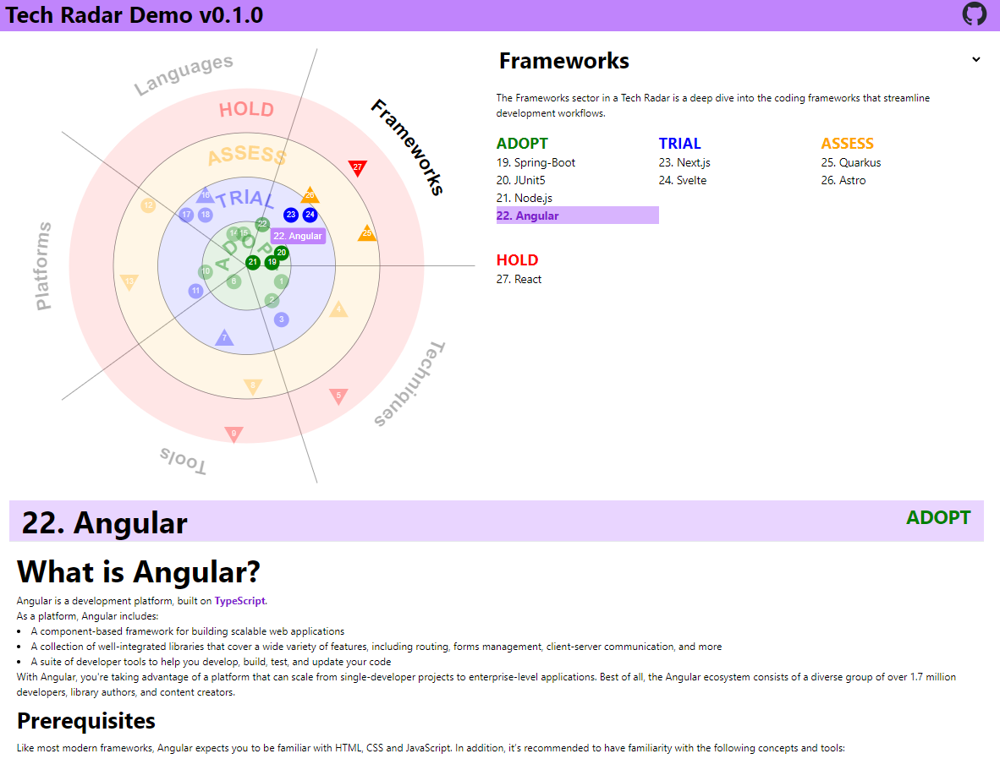
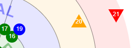

# EG: Technology Radar

### What is a Tech Radar?

Tech Radar is meant to be used as a guide to help teams and organizations make informed decisions about the technologies they should adopt. It can be used as a knowledge base for the team to learn about the latest trends and best practices in the industry. It can also be used as a tool to facilitate discussions and align teams on the technologies they should adopt.

 <br>

---
### How to use this Tech Radar?

This technology radar can be used as a starting point for your own radar that can be easily configured with your dimensions and style preferences. It is built using [Angular](https://angular.io/), [Tailwind CSS](https://tailwindcss.com/) and [eg-radar](https://github.com/EdgarsGarsneks/eg-radar)<br>

To get started, clone this [repository](https://github.com/EdgarsGarsneks/eg-tech-radar) and run `npm install` to install all the dependencies. Once the dependencies are installed, run `ng serve` to start the application. Navigate to `http://localhost:4200/` to view the application.

### How to customize the Tech Radar?

All the configuration for the radar is stored in the `radar-config.json` file. This file contains the configuration for the sectors, rings and blips and their styling. <br><br>

Config example

```json
{
    "width": 700,
    "style": {
        "background": "#fff"
    },
    "sectors": [
        { "label": "Techniques", "data": { "md": "assets/markdown/sectors/techniques/techniques.md"}}
    ],
    "rings": [
        { "label": "ADOPT",  "color": "green" }
    ],
    "entries": [
        { "label": "My Entry", "sector": 0, "ring": 1, "moved": 0, "data": { "md": "assets/markdown/sectors/markdown.md"}}  
    ]
}
```

---
#### Sectors & Rings

This Tech Radar can be divided into multiple sectors of interest. Each sector represents a different aspect of the technology landscape. Sectors are further divided into rings: Each ring represents a different actions/ level of maturity or any other dimension and is color-coded for easy identification. <br><br>

For inspiration you can look at [Thoughtworks](https://www.thoughtworks.com/radar) dimensions, but you are free to define your own. <br><br>

| Sector                       | Description                                                                                                                                                                                 |
| ---------------------------- | ------------------------------------------------------------------------------------------------------------------------------------------------------------------------------------------- |
| **Techniques**               | These include elements of a software development process, such as experience design; and ways of structuring software, such as microservices.                                               |
| **Platforms**                | Things that we build software on top of such as mobile technologies like Android, virtual platforms like the JVM, or generic kinds of platforms like hybrid clouds.                         |
| **Tools**                    | These can be components, such as databases, software development tools, such as versions' control systems; or more generic categories of tools, such as the notion of polyglot persistence. |
| **Languages and Frameworks** | These include programming languages like Java and Python but today primarily focus on frameworks like Gradle, Jetpack, and React.js.                                                        |

<br>Which are further divided into rings: <br><br>

| Ring       | Description                                                                                                                                                                                                                                                                                                                                                      |
| ---------- | ---------------------------------------------------------------------------------------------------------------------------------------------------------------------------------------------------------------------------------------------------------------------------------------------------------------------------------------------------------------- |
| **Adopt**  | Things that we think you should seriously consider using. We don't say that you should use these for every project; any tool should only be used in an appropriate context. However we do think that a blip in the Adopt ring represents something where there's no doubt that it's proven and mature for use.                                                   |
| **Trial**  | Things that we think are ready for use, but not as completely proven as those in the Adopt ring. So for most organizations we think you should use these on a trial basis, to decide whether they should be part of your toolkit. We've used trial blips in production, but we realize that readers may be more cautious than us                                 |
| **Assess** | Things to look at closely, but not necessarily trial yet — unless you think they would be a particularly good fit for you. Typically, blips in the Assess ring are things that we think are interesting and worth keeping an eye on.                                                                                                                             |
| **Hold**   | Things that, even though they may be accepted in the industry, we haven't had a good experience with. Therefore we are calling them out to warn you that you may run into trouble with them as well. Sometimes it means we think they're irredeemably flawed; or just being misused. We do place things in the Hold ring that we wish the industry wouldn't use. |

#### Blips

Blips are the individual elements that make up the radar. Each blip represents a technology, tool, framework, or methodology that is relevant to the team. Blips are placed in the radar based on their sector and ring. Blips can have three different states - round, arrow up and arrow down. These states can be used to indicate the current state of the technology. For example, if a technology is trending upwards, it can be represented by a blip with an arrow up. If a technology is trending downwards, it can be represented by blip with an arrow down. <br><br>

 <br>

Blips are selectable and can be linked to a markdown file that contains more information about the blip, including the pros and cons of using it, the use cases, training materials and the best practices. Anything that makes sense to you. <br><br>

### Styling

Tech radar uses [eg-radar](https://github.com/EdgarsGarsneks/eg-radar) component to render the radar. This component can be customized to fit your style preferences. For more information on how to customize the radar, please refer to the repository. Other page styling can be done by applying custom CSS based on your needs. <br><br>

---

### Contributions

Contributions are welcome. Please read [CONTRIBUTING.md](https://github.com/EdgarsGarsneks/eg-tech-radar/blob/main/CONTRIBUTING.md) for more information. <br><br>

Special thanks to all the people who have already contributed to this project! 

<a href="https://github.com/EdgarsGarsneks/eg-tech-radar/graphs/contributors">
  
</a>

### Support

<a href="https://www.buymeacoffee.com/edgars.garsneks" target="_blank"></a> 